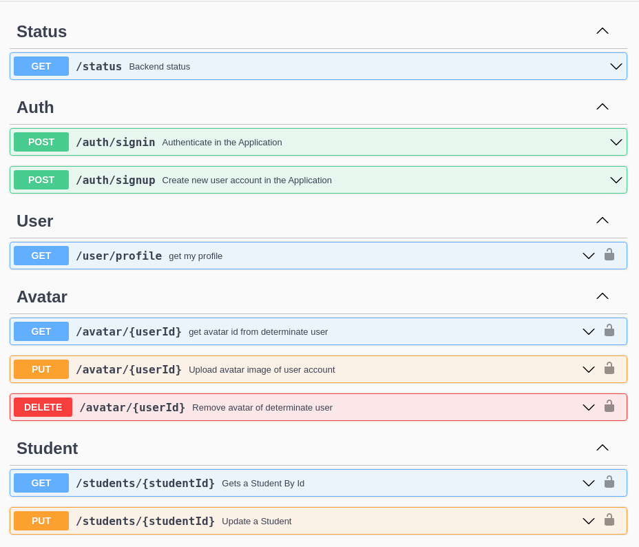
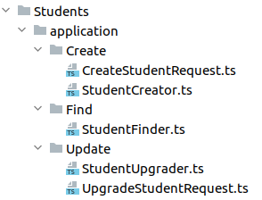
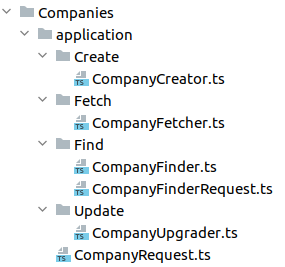

# LagunaLink
    
Proyecto Final de Grado Superior de DAW para el IES LAGUNA DE JOATZEL.


- [LagunaLink](#lagunalink)
- [INTRODUCCIÓN](#introducción)
  - [MOTIVACIÓN](#motivación)
  - [OBJETIVO DESCRIPCION Y ALCANCE](#objetivo-descripcion-y-alcance)
- [ANALISIS](#analisis)
  - [CASOS DE USO](#casos-de-uso)
  - [REQUISITOS](#requisitos)
    - [REQUISITOS FUNCIONALES](#requisitos-funcionales)
    - [REQUISITOS NO FUNCIONALES](#requisitos-no-funcionales)
- [DISEÑO](#diseño)
  - [DEFINICIÓN DEL SISTEMA](#definición-del-sistema)
  - [DOMAIN-DRIVEN DESIGN](#domain-driven-design)
  - [CAPAS DE LA ARQUITECTURA](#capas-de-la-arquitectura)
  - [NUESTRO MODELO DE DOMINIO](#nuestro-modelo-de-dominio)
  - [CAPA DE APLICACIÓN](#capa-de-aplicación)
  - [CAPA DE INFRAESTRUCTURA](#capa-de-infraestructura)
- [IMPLEMENTACIÓN](#implementación)
  - [CICLO DE VIDA DE UNA PETICIÓN](#ciclo-de-vida-de-una-petición)
- [PRUEBAS](#pruebas)
  - [SISTEMA DE PRUEBAS](#sistema-de-pruebas)
- [FRONTEND](#frontend)
  - [DISEÑO DE INTERFAZ](#diseño-de-interfaz)
  - [COLORES ELEGIDOS](#colores-elegidos)
- [DESPLIEGUE](#despliegue)
  - [ENTORNO DE DESARROLLO](#entorno-de-desarrollo)
  - [ENTORNO DE PRODUCCIÓN](#entorno-de-producción)
  - [SISTEMA DE INTEGRACIÓN CONTINUA CI/CD](#sistema-de-integración-continua-cicd)
- [FUNCIONAMIENTO DE LA APLICACIÓN](#funcionamiento-de-la-aplicación)
  - [SIGNUP](#signup)
  - [SIGNIN](#signin)
  - [DASHBOARD](#dashboard)
  - [PROFILE](#profile)
  - [JOB OPENINGS](#job-openings)
  - [ENROLLMENTS](#enrollments)
- [CONCLUSIONES](#conclusiones)
  - [EXPERIENCIA](#experiencia)
  - [PROBLEMA](#problema)
  - [FUTURO](#futuro)
- [BIBLIOGRAFÍA](#bibliografía)

# INTRODUCCIÓN
## MOTIVACIÓN

Durante el primer año del grado de superior de informática, nuestra
profesora de los módulos de Formación Orientativa Laboral y Empresa e
Iniciativa Emprendedora, nos estuvo comentando acerca de Empresas que
traían ofertas de trabajo al instituto, y que era bastante tedioso que
los profesores tuvieran que hacer de intermediarios entre los
Estudiantes y las Empresas que venían al centro a buscar talento y
ofrecer prácticas.

Por ende, aprovechando la oportunidad que nos brinda el trabajo final
del grado, nos gustaría crear un medio de interrelación entre Empresas y
Estudiantes.
## OBJETIVO DESCRIPCION Y ALCANCE

El objetivo principal del proyecto es crear una aplicación web, que
sirva de canal de relación entre los Estudiantes del centro y las
Empresas del mundo laboral.

Con este motivo, su descripción se resume en dos tipos de roles
diferentes. Por un lado, están los Estudiantes, los cuales una vez se
registran en la plataforma pueden completar su currículum. Por otro
lado, están las Empresas, que tendrán la opción de publicar sus vacantes
de empleo, las cuales aparecerán en el Tablón/Home/Dashboard general de
la aplicación, al cual tienen acceso tanto Estudiantes como Empresas.

Los Estudiantes pueden aplicar(inscribirse) a dichas ofertas, quedando
registrado el interés de dicho Estudiante en la vacante publicada por la
Empresa, junto a su currículum para que sea evaluado por la Empresa.

En caso de que la Empresa esté interesada en alguno de los perfiles que
han aplicado a su vacante, ésta tendrá la posibilidad de enviarle un
correo electrónico con las indicaciones para continuar con el proceso de
selección.

El alcance de nuestra aplicación está concebido a nivel mundial. Es
decir, toda aquella persona que haya estudiado o no en el centro IES
Laguna de Joatzel, podrá crearse una cuenta. Al igual que para cualquier
comercio/empresa que quiera publicar sus ofertas laborales, podrá
hacerlo.

Dado que este proyecto puede servirnos como carta de presentación para
futuros empleos en el sector TIC, nos hemos auto impuesto una serie de
objetivos complementarios. Intentaremos hacerlo lo más aproximado
posible a un entorno real que nos podríamos llegar a encontrar
futuramente. Para ello, hemos definido una serie de requisitos no
funcionales que detallaremos más adelante.

# ANALISIS

## CASOS DE USO


## REQUISITOS

### REQUISITOS FUNCIONALES
- Debe ser un sistema cerrado, solo los USUARIOS registrados pueden ver las ofertas publicadas.
- Debe de existir un registro de tipo ALUMNOS.
- Debe existir un registro de tipo EMPRESAS.
- Debe existir algún método de seguridad que compruebe que detrás de una creación de cuenta existe una persona
- Los ALUMNOS pueden cumplimentar su CURRICULUM.
- Las EMPRESAS pueden crear OFERTAS de empleo.
- Tanto ALUMNOS como EMPRESAS pueden ver todas las OFERTAS de empleo publicadas.
- Los estudiantes pueden APLICAR (inscribirse) en cada OFERTA.

### REQUISITOS NO FUNCIONALES
- Todo el código escrito en inglés.
- Elaboración de código limpio.
- Aplicación de los principios [SOLID](https://es.wikipedia.org/wiki/SOLID)
- Desarrollo con metodología agile [( ATDD )](https://www.javiergarzas.com/2015/07/que-es-eso-de-atdd.html)
- Adopción de los principios de arquitectura limpia mediante patrón [DDD](https://es.wikipedia.org/wiki/Diseño_guiado_por_el_dominio)
- Integracion Continua CI/CD

# DISEÑO
## DEFINICIÓN DEL SISTEMA

Teniendo en cuenta todos los requisitos anteriormente citados, y con el
fin de aumentar nuestro conocimiento ,hemos tomado la decisión de
dividir la aplicación en dos servicios. Por un lado tenemos un Backend
desarrollado en TypeScript con ExpressJS, con la misión de gestionar los
usuarios y las ofertas de empleo. El segundo servicio es un Frontend
desarrollado en ReactJS, con el que interactúan los usuarios. Ambos
servicios se comunican a través de una API REST ofrecida por el Backend.

Dicha API está diseñada siguiendo la especificación de
[<span class="underline">OpenAPI
3.0</span>](https://swagger.io/specification/). La documentación de la
API la hemos generado apoyándonos en el módulo de Swagger que hay para
ExpressJS (framework de NodeJS) y se puede probar/consultar en
[<span class="underline">https://lagunalink-be.herokuapp.com/docs</span>](https://lagunalink-be.herokuapp.com/docs)



Para la persistencia de datos hemos elegido MongoDB como gestor de base
de datos, solo por el mero hecho de descubrir algo diferente al
tradicional sistema relacional de SQL.

## DOMAIN-DRIVEN DESIGN

> Se trata de un conjunto de prácticas, técnicas, herramientas y
> enfoques para dar respuesta a las necesidades complejas en el
> desarrollo de software, orientadas al core del negocio, su evolución y
> sus objetivos. Pone el foco en el problema relevante y básicamente
> ayuda a identificar la arquitectura e informar sobre los mecanismos
> que el software necesita replicar.

La importante necesidad de entender el negocio y su complejidad con una
comunicación intensa y directa con los expertos de dominio mediante un
único tipo común de lenguaje llamado ***lenguaje ubicuo***. Fomentando
así un código de calidad centrado en soluciones específicas de problemas
bien entendidos de negocio y reflejado en el comportamiento del software
que generamos.

DDD se divide en dos grandes grupos en los que cada cual existen pautas
a seguir para el buen desempeño: el estratégico y el táctico.


Resumiéndolo mucho, podemos decir que la parte estratégica es la más teórica, y la parte táctica es la más práctica.

Debido a que nuestro proyecto es demasiado pequeño, decidimos hacer la
aproximación por la parte táctica, la cual tiene los siguientes
conceptos clave:

**VALUE OBJECT:**

Es el objeto más pequeño que existe dentro del sistema. Están concebidos
para **cuantificar o describir un concepto** de nuestra capa de dominio.
Se utilizan para modelar conceptos de nuestro sistema, como pueden ser
identificadores, fechas o rangos de fechas, precios, pesos, velocidades
(prácticamente cualquier magnitud es modelable como VO), o incluso
títulos, nombres o direcciones. Son **inmutables**, no tienen
identificador, dado que **se identifican por su propio valor** (por
ejemplo, el color azul), por lo cual, cuando en una entidad cambia ese
valor, se destruye ese VO y se genera otro nuevo. Al ser objetos tan
simples, el impacto de la creación/destrucción en el ***performance***
es mínimo. Las comparaciones entre VO son por valor y no por referencia.

**ENTIDAD:**

Son objetos que **tienen identidad**, normalmente un
[<span class="underline">GUID</span>](https://www.espaciobim.com/guid),
[<span class="underline">UUID</span>](https://en.wikipedia.org/wiki/Universally_unique_identifier)
o ID. Esto significa que aunque dos objetos de la misma clase tengan los
mismos valores de atributos, no son iguales, sino que la identidad es
quien los identifica como el mismo objeto. Las entidades son capaces de
ser buscadas, almacenadas y recuperadas. Hay que tener en cuenta que
según el contexto, una entidad representa algo particular del mismo.

**AGREGADO:**

Son grupos de entidades y value objects que se relacionan entre sí y
donde se define la dependencia entre ellas. En dichos agregados hay que
definir cuál es la Entidad padre (Aggregate root) y cuál es la frontera,
es decir, definir qué está dentro del agregado y qué no.

**REPOSITORIOS:**

Son los elementos que se encargan de persistir y recuperar los agregados
que necesitamos que pervivan en el tiempo. Como mínimo debe existir un
repositorio por cada agregado. En la capa de dominio, el repositorio
define el contrato (definido como puerto) que debe implementar el
repositorio ubicado en la capa de infraestructura (definido como
adaptador).

**SERVICIOS:**

Son los procesos que realizan determinadas tareas. Pueden existir en la
capa de dominio (domain services) como en la capa de
aplicación(application services). Para evitar sobre-complejidad en
nuestro caso, hemos decidido empujar hacia los aggregate root toda la
lógica comúnmente asociada a los servicios de dominio. Por cada **caso
de uso**, tenemos un ***Application Service*** que realiza esa tarea.

## CAPAS DE LA ARQUITECTURA


## NUESTRO MODELO DE DOMINIO


## CAPA DE APLICACIÓN

Es donde reunimos los servicios de aplicación (use
cases) nombrados con terminaciones verbales (Finder, Creator, Upgrader),
junto con las declaraciones de los DTO cuyos nombres finalizan en
Request.




## CAPA DE INFRAESTRUCTURA

En esta parte residen todas implementaciones (adaptadores) de cada uno
de los interfaces (puertos) que teníamos declarados en la capa de
dominio.


Cabe destacar que también disponemos de una zona común
([<span class="underline">shared
kernel</span>](http://ddd.fed.wiki.org/view/shared-kernel)) en el cual
se aloja toda la lógica compartida por los Agregados


# IMPLEMENTACIÓN

## CICLO DE VIDA DE UNA PETICIÓN


En la anterior ilustración podemos observar la **cadena de actores** que
intervienen en el **ciclo de vida de una petición**. El bloque amarillo
representa nuestro dominio, el cual no conoce nada de lo anterior. Le
sigue el bloque azul que es la capa de aplicación, que si conoce dominio
pero no conoce nada de los bloques rojos que pertenecen a la capa de
infraestructura.

Siguiendo el **Principio de Responsabilidad Única**, tanto cada
*servicio de aplicación* como cada *controlador,* tienen un **único
punto de entrada**.

``` TypeScript
async run(request: CreateUserRequest): Promise\<void\> {

  await this.ensureUserNotExist(request.email);

  const passwordHashed = *hashSync*(request.password, 10);

  const user = User.create(

    new UserId(request.id),

    new UserEmail(request.email),

    new UserPassword(passwordHashed),

    new UserIsActive(request.isActive),

    new UserRole(request.role),

    new UserAvatar(),

    UserCreatedAt.now(),

    UserUpdatedAt.now()

  );

  await this.repository.save(user);

  this.logInfo(`user ${user.email.value} created`);

  await this.confirmService.sendTo(user);

}
```

Siguiendo el **Principio de Inversión de Control**, todas las
dependencias de los servicios de aplicación y controladores, se inyectan
en tiempo de creación del objeto a través del contenedor de dependencias
el cual ha sido previamente configurado mediante su declaración en yaml.


En la anterior ilustración podemos observar la *responsabilidad única*
de cada ***controlador***, con la cual conseguimos una mejor
mantenibilidad.

Como último apunte, remarcar que no retornamos el Estado, dado que
seguimos la filosofía **“*No news, good news”****.* En caso de que
exista algún error lanzaremos la excepción de dominio correspondiente.

# PRUEBAS

## SISTEMA DE PRUEBAS

Para garantizar que el funcionamiento cumplía con los requerimientos
hemos adoptado la metodología de desarrollo guiado por comportamiento
[<span class="underline">BDD</span>](https://es.wikipedia.org/wikDesarrollo_guiado_por_comportamiento).


Dicha metodología consiste en seguir los siguientes pasos:

- Por cada requisito funcional, generamos la prueba de aceptación,
apoyándonos en Gherkins y Cucumber, la cual al lanzarla nos
saldría en ROJO, por no tener nada implementado todavía.

```gherkin
Scenario: Publish a Job Opening

Given I have a Company Role Account

And I am logged in the application

When I send a POST request to "/job_openings" with body:

"""

{

"description": "Frontend Developer",

"position": "Junior Frontend Developer",

"conditions": "salario 20K anuales",

"responsibilities": "Desarrollo de interfaz de aplicación web",

"qualification": "Técnico Superior en desarrollo de aplicaciones
web",

"prevExperience": "3 meses",

"hiringDate": "05-11-2022"

}

"""

Then the response status code should be 201
```


- Entramos en el ciclo de TDD, en el que creamos primero las pruebas unitarias, que al ejecutarlas saldrian en ROJO al no tener nada implementado.

```javascript
describe('JobOpening', () => {

  it('should return a new jobOpening instance', () => {

    const request = CreateJobOpeningRequestMother.random();

    const jobOpening = JobOpeningMother.fromCreateRequest(request);

    expect(jobOpening.company.value).toBe(request.company);

    expect(jobOpening.title.value).toBe(request.title);

    expect(jobOpening.position.value).toBe(request.position);

  });

});
```

**NOTA:** 
> A la hora de construcción de los objetos hemos implementado el patrón creacional [<span class="underline">Object Mother<span>](https://martinfowler.com/bliki/ObjectMother.html) junto con el módulo [<span class="underline">Faker JS<span>](https://github.com/marak/Faker.js/) para la generación de los datos.

> Las pruebas unitarias cumplen con el principio FIRST(Fast, Isolated, Repeatable, Self checking, Timely) Por ejemplo, en el caso de las pruebas de los servicios de aplicación ( casos de uso ) utilizamos dobles de test que reemplazan todo lo que tenga que ver con el Input/Output

```javascript
let repository: JobOpeningRepositoryMock;

let creator: JobOpeningCreator;

beforeEach(() =\> {

repository = new JobOpeningRepositoryMock();

creator = new JobOpeningCreator(repository);

});

it('should create a valid jobOpening', async () =\> {

const request = CreateJobOpeningRequestMother.random();

const jobOpening = JobOpeningMother.fromCreateRequest(request);

await creator.run(request);

repository.assertLastSavedJobOpeningIs(jobOpening);

});
```

- Implementamos lo más rápido posible para que salga en VERDE.

- Refactorizamos el código, mejorándolo si es necesario para que
quede más limpio y en caso de que siga siendo el resultado de las
pruebas unitarias en VERDE saldríamos del ciclo TDD.


- Volveriamos a correr la prueba de
aceptacion, que en este caso nos devuelve un todo ok en forma de
color VERDE.

# FRONTEND
    
## DISEÑO DE INTERFAZ


En este apartado nos centramos únicamente en usar el Framework
[<span class="underline">ReactJS</span>](https://es.reactjs.org/) pero
con una extensión de Google llamada [<span class="underline">ReactJS
Material UI</span>](https://material-ui.com/es/), es por así decirlo,
usar un framework dentro de otro framework. ReactJS Material UI es un
framework que usa un [<span class="underline">GRID</span>](https://developer.mozilla.org/es/docs/Web/CSS/grid) 
idéntico al clásico [<span class="underline">Bootstrap
4.0</span>](https://getbootstrap.com/). Pero gracias a la finalidad del
propio ReactJS original de otorgarnos ***componentes*** para su
reutilización, decidimos, por curiosidad y rapidez, usar este potente
framework. Y no cabe decir que el nombre de esta tecnología le ha sonado
a más de uno de haber usado un entorno de desarrollo con sus temas
visuales, ¿verdad?


*Evidentemente hay que instalarlo añadiéndolo a una dependencia del
package.json.* En la siguiente vista os mostramos el “main” de ReactJS
con sus respectivos imports.


Para la estilización y personalización del CSS decidimos implementarlo
con código de JavaScript por comodidad. Por ejemplo:


La conexión con la API REST del Backend fue gracias a la librería de
***AXIOS,*** pero en este apartado no vamos a detallar mucho los
despliegues. Muestro a continuación los 2 tipos de conexión que tenemos.


Si se fijan, una vez el Backend tuvo sus primeras versiones, decidimos
desplegarla al Hosting para ahorrar recursos de PC en el desarrollo de
la GUI.

Para terminar este apartado, enseñamos el resto del contenido de este
importante fichero.


***NOTA:** se decidió no meter TS en el Frontend por la complejidad que
daba con el ReactJS Material UI.*

## COLORES ELEGIDOS

Los colores elegidos han sido **Azul y Blanco**, porque el azul aporta
serenidad y paz al cliente/usuario y genera una sensación de seguridad y
confianza, y el blanco nos aporta elegancia y minimalismo. Nos
inspiramos en las apps de búsqueda de empleo como InfoJobs o Linkedin.

# DESPLIEGUE
    
## ENTORNO DE DESARROLLO
    
Para el desarrollo de la app usamos Intellij IDEA para el Backend,
gracias a nuestro centro educativo nos otorga una licencia educativa,
junto con Visual Studio Code para desarrollar el Frontend al ser éste
muy ligero y gratuito. Para las cuestiones que tienen que ver con la
interacción en la base de datos de MongoDB usamos el cliente que trae
integrado intellij .

En las primeras pruebas manuales que hacíamos contra la API del Backend
usamos Postman.

## ENTORNO DE PRODUCCIÓN

Para hacer la demostración de la aplicación junto con el aprendizaje de
la **integración continua** teníamos decidido hacer un despliegue a
través de algún servicio de hosting.

Después de valorar diferentes plataformas, hemos considerado que lo más
adecuado era que desplegamos los dos servicios en
[<span class="underline">Heroku</span>](https://www.heroku.com/) por el
motivo de que teníamos más margen de maniobra dentro de la oferta sin
coste.

La única peculiaridad que tiene dicho servicio es que son de ***tipo
serverless***, en el cual nuestra aplicación vive en una *lambda* al
estilo de las de
[<span class="underline">AWS</span>](https://aws.amazon.com/es/lambda/),
la cual cuando pasa determinado tiempo sin carga de trabajo entra en
estado de reposo, y al hacer la primera petición tarda más de la cuenta.
Pero una vez que está levantada, tenemos tiempos de respuesta bastante
aceptables.

Para el servicio de persistencia hemos utilizado el propio servicio de
Cloud
([<span class="underline">Atlas</span>](https://www.mongodb.com/es/cloud/atlas))
que ofrece MongoDB.

La URL de la aplicación es
[<span class="underline">http://lagunalink.herokuapp.com</span>](http://lagunalink.herokuapp.com/)

NOTA: para esta demo no hemos implementado https, dado que **no
disponíamos de certificado.**

## SISTEMA DE INTEGRACIÓN CONTINUA CI/CD

A partir del momento en que tuvimos una buena base de pruebas
automatizadas, hemos implementado un **sistema básico de integración
continua** basado en el *pipeline* de [<span class="underline">Github
Actions</span>](https://github.com/features/actions), en el cual
definimos unas acciones predeterminadas que tienen que dispararse a la
hora que hacer **Pull Request** a la *rama Master.*
    
```yml
name: Node CI

on: [workflow_dispatch, pull_request]

jobs:
  build:
    runs-on: ubuntu-latest

  strategy:
    matrix:
      node-version: [12.x, 14.x]
      mongodb-version: [4.0, 4.2]

    steps:
      - uses: actions/checkout@v1
      - name: Use Node.js ${{ matrix.node-version }}
        uses: actions/setup-node@v1
        with:
          node-version: ${{ matrix.node-version }}
      - name: Launch MongoDB
        uses: wbari/start-mongoDB@v0.2
        with:
          mongoDBVersion: ${{ matrix.mongodb-version }}
      - name: npm install, build, and test
        run:
          npm ci
          npm run build --if-present
          npm test
        env:
          CI: true
```
Dicha acción no es más que levantar una serie de **stacks definidos en
la matriz**, en los que ejecutaba la batería de pruebas entera
(unitarios, integración, aceptación) y que no **permite
mergear** el código hasta que no pasan todos los
test.

En el caso de que fallara algún test, nos avisa por varios canales. Uno
de ellos es indicandolo en el *badge* que tenemos en el *Readme del
repositorio*, como se muestra en la siguiente ilustración.

> 

Otro canal de comunicación del fallo, es enviandonos un correo indicando
que no se ha completado la pipeline.

Una vez que ya tuvimos desplegada la aplicación en
producción, fue cuando activamos el sistema de **despliegue continuo**,
en el cual, siguiendo nuestro Git flow adoptado previamente, la rama
desplegada a producción era la rama master.

Por lo cual, en el momento que existan cambios en esa rama, y habiéndose
ejecutado previamente la *pipeline* anteriormente citada, solo en ese
caso, se genera un build nuevo y se despliega sin intervención humana,
gracias a la **integración que tiene Heroku con Github**.


# FUNCIONAMIENTO DE LA APLICACIÓN

Los users únicos son manu@me.com y josevega234@gmail.com, luego para las
Empresas usamos a1@me.com, a2@me.com y a3@me.com y luego para los
Estudiantes igual pero desde b1@me.com hasta b8@me.com y uno creado para
los pantallazos de new user llamado c1@me.com. Todos los users tienen
como password 1234.

## SIGNUP

***VISTA DESKTOP:***


***VISTA RESPONSIVE:***


Como podemos observar tenemos un simple formulario de registro que
cuenta con un desplegable para elegir el tipo de cuenta entre ESTUDIANTE
o EMPRESA.

 

Una vez completado el registro, para evitar la creación masiva de
cuentas de usuario, necesitamos activar la cuenta a través del correo de
confirmación que se nos ha enviado a nuestro buzón de correo.


Una vez pinchamos en el link nos redirecciona a la vista *CONFIRMED*


Si no verificas el correo te saltará un aviso. Esto lo hacemos para
evitar que los Bots nos creen cuentas randoms.


Y por supuesto, si introducimos un usuario que no existe nos saltará
esta vista:


Como pueden observar por precaución contra los hackers no decimos que el
user no existe, ni si el error viene de la contraseña o el email. Esta
es una pequeña práctica que se debe implementar para no darle
oportunidad a los hackers que quieran suplantar una identidad.

## SIGNIN

***VISTA DESKTOP:***


***VISTA RESPONSIVE:***


Login básico con un botón de ***ENTRAR*** donde tenemos que introducir
un correo, una contraseña y verificarlo por Mailtrap. Si no se tiene una
cuenta el cliente debe registrarse para acceder a su contenido. También
disponemos de un recuérdame como ***CHECKBOX***.

## DASHBOARD

*EMPRESA*

***VISTA DESKTOP:***


***VISTA RESPONSIVE:***

 

Lo primero que vería una Empresa registrada sería el Dashboard o Tablón
donde se anuncian todas las ofertas de trabajos disponibles. A la
izquierda tenemos el navegador con 4 pestañas accesibles: Inicio,
Perfil, ***Ofertas Publicadas*** y SALIR. Por defecto lo primero que
vemos es el Inicio.

*ESTUDIANTE*


## PROFILE

EMPRESA:

***VISTA DESKTOP:***


***VISTA RESPONSIVE:***

 

ESTUDIANTE:

***VISTA DESKTOP:***


***VISTA RESPONSIVE:***


## JOB OPENINGS

SOLO PARA EMPRESA:

***VISTA DESKTOP:***


En el apartado de Ofertas Publicadas donde está la lista de las ofertas
de la Empresa, tenemos la posibilidad de acceder inmediatamente al
contenido de su información con tan solo pinchar en ella, y por supuesto
modificarla. Para modificarla tan solo tenemos que darle click a
cualquier campo del formulario y rellenar (pruebe a insertar un espacio)
para activar 2 botones CANCELAR y GUARDAR. Si se fija en cada oferta
publicada tenemos también la posibilidad de borrarla (icono de
Papelera), pero ésta solo se borrará de Empresa, ya que el Estudiante
que esté inscrito todavía la mantendrá en su apartado *Ofertas Aplicadas
o Enrollments* pero tendrá una señalización que indique “*esta oferta
fue eliminada*” y no podrá acceder a ver su contenido.

El componente ***Adscritos*** es un botón que actúa como contador e
incrementa a medida que un Estudiante se aplica en la oferta.


Como podemos observar, nos lista todos los Estudiantes que se han
aplicado a la oferta de trabajo y con darle un click entramos a ver su
CV y nos otorga un botón para **CONTACTAR.**


Las siguientes vistas son para crear una Oferta de Trabajo o JOB OPENING
.


Como podemos observar cuando una Empresa crea una oferta de trabajo nos
imprime un formulario vacío donde tenemos que rellenar todos los campos.
Si se le da a Guardar, la nueva oferta se publicará en el
Tablón/Dashboard/Inicio, pero si se le da a Cancelar nos regresará a
Ofertas Publicadas.

***VISTA RESPONSIVE:***


## ENROLLMENTS

SOLO PARA ESTUDIANTE:

***VISTA DESKTOP:***


Como podemos observar, a parte de tener un editor de Avatar con 2
botones de Subir Imagen y Eliminar al igual que en Empresa. Ahora en
Estudiante nos muestra una lista de ofertas aplicadas, de las cuales
podemos desapuntarnos borrándolas. Si se fija, hay una oferta eliminada
por parte de la Empresa, pero nos deja constancia de ello. Por último
hay un icono con un Ojo que nos envía a ver los detalles de la oferta
laboral inscrita.

***VISTA RESPONSIVE:***


# CONCLUSIONES
    
## EXPERIENCIA

Mediante la separación del proyecto en dos servicios aprendimos a mejorar la escalabilidad y mantenibilidad de un Software de la forma mas real posible. Tener un Frontend independiente de un Backend ha sido una grata experiencia que agradeceremos cuando nos adentremos al mundo laboral.

La experiencia con Docker fue dura, porque el concepto de despliegue
para el desarrollo es completamente diferente a las clásicas de maquinas virtuales. Sin embargo, aunamos esfuerzos en aprenderlo dado es una tecnología imprescindible en nuestro sector. 

Hemos comprobado que nuestra elección de el proceso de desarrollo mediante la practica del modelo CI/CD ( Integracion Continua, Despligue Continuo) nos ha servido para evitar muchos bugs que teníamos en nuestro codigo, y que hubieran roto la aplicación.

Como conclusión, el STACK de MERN (MongoDB + Express + ReactJS + NodeJS),pensamos que puede ser la tecnología mas adecuada a un desarrollador fullstack, ya que resulta cómodo que su sintaxis sea igual tanto para el Frontend como el Backend como el Database NoSQL. Así olvidamos de preocuparnos por la sintaxis del lenguaje de programación y nos centramos solo en la lógica de desarrollo, consiguiendo mejorar drásticamente nuestra productividad, ya que con solo JavaScript podemos crear una aplicación de web entera (e incluso de móvil con React Native y de escritorio con ElectronJS), y si a eso le sumamos TypeScript conseguimos todavía mejor mantenibilidad gracias a las caracteristicas que TS nos otorga como por ejemplo la abstraccion con interfaces y el tipado estatico.

## PROBLEMA

El principal problema fue el difícil entendimiento de la Clean
Architecture, ya que al ser muy abstracta y completamente diferente al
clásico MVC, puede resultar tedioso de entender. Sin embargo, en la
bibliografía van a encontrar las mejores fuentes para entenderlo, y como
ya habéis visto antes es mejor compararlo coloquialmente con la
distribución de directorios de un MVC.

Otro gran problema, fue el entendimiento de MongoDB, ya que al ser NoSQL
no podíamos hacer las clásicas consultas del lenguaje SQL. Sin embargo,
su potencia lo compensa mucho y la verdad es que usar funciones tampoco
es difícil de entender. Eso sí, los índices hay que tenerlos bien
controlados porque nos ha dado muchos problemas.

## FUTURO

Nos gustaría mejorar la interactividad de la interfaz cliente haciéndola
todavía más intuitiva, y mejorar algunos colapsos en los dispositivos
móviles, dándole más estilo.

Se podría exigir más información a las empresas que se registran, como
por ejemplo quién es el dueño de la empresa y alguna especie de
comprobante legal que verifique su existencia para así evitar que se
registre cualquiera como empresa.

También estaría genial enchufarse a los registros reales de los alumnos
del centro, para crear automáticamente una cuenta cuando nos entreguen
los carné de estudiantes del centro, algo así como las cuentas de
EducaMadrid que nos daba el centro.


# BIBLIOGRAFÍA

- CodelyTV (SOLID, DDD):
  [<span class="underline">http://codely.tv/</span>](http://codely.tv/)

- Fatzcode (JavaScript, ReactJS, MongoDB, TS):
  [<span class="underline">https://www.faztweb.com/</span>](https://www.faztweb.com/)

- Bluuweb (ReactJS Material UI):
  [<span class="underline">https://bluuweb.github.io/</span>](https://bluuweb.github.io/)

- David Navarro (ReactJS):
  [<span class="underline">https://davidnavarro.dev/</span>](https://davidnavarro.dev/)

- EDTeam (Esquemas):
  [<span class="underline">https://ed.team/</span>](https://ed.team/)

- OpenWebinars (DDD, Docker, CI/DI):
  [<span class="underline">http://openwebinars.net/</span>](http://openwebinars.net/)

- Carlos Buenosvinos (DDD):
  [<span class="underline">https://carlosbuenosvinos.com/</span>](https://carlosbuenosvinos.com/)

- RJ Code Advance (DDD vs MVC):
  [<span class="underline">https://rjcodeadvance.com/
  </span>](https://rjcodeadvance.com/)

- Manuel Cillero (tests):
  [<span class="underline">https://manuel.cillero.es/</span>](https://manuel.cillero.es/)

- Makigas (curso TS, Git):
  [<span class="underline">https://www.makigas.es/</span>](https://www.makigas.es/)

- StackOverflow (comodín para cualquier duda):
  [<span class="underline">https://stackoverflow.com/</span>](https://stackoverflow.com/)